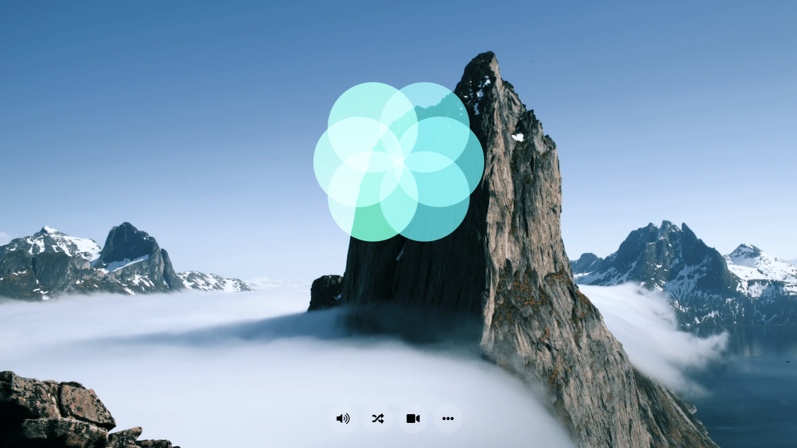

# meditation-app

- [Live Demo](https://edumigueis.github.io/meditation-app/)
---
>  An amazing website made for meditating and relaxation. It was developed with javascript and scss. It presents settings and variable content. Photos and videos provided by Pexels, and audios provided by Free Audio Library.

  

- This app can show a breath animation, relaxing videos and music.
- Made with javascript, html and css.
---

## Installation

- To run this project you need to download it and open the html file in a browser.

### Clone

- Clone this repo to your local machine using `https://github.com/edumigueis/meditation-app.git`
---

## License

- **[Apache-2.0 LICENSE](https://www.apache.org/licenses/LICENSE-2.0)**
- Copyright 2020 © Eduardo Migueis.
